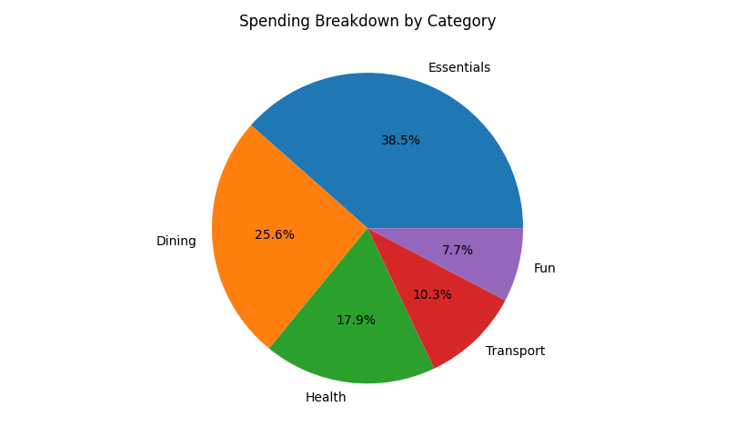

# Maybe Finance — Zeshan

**Open-source automation for real-world personal finances.**  
_Instantly analyze your spending with a private, scriptable tool — no fintech app required. 🎯✨_


---

## 🚀 Quick Start (in under 60 seconds)

1. **Upload your data**
    - Use the included `expenses_sample.csv`
    - Or export from your bank:  
      **Your CSV must have these columns in this exact order:**

      ```
      Date,Merchant,Category,Amount
      2025-08-01,Coffee Shop,Fun,5
      2025-08-02,Supermarket,Groceries,45
      2025-08-03,Train Station,Transport,12
      ```

    - **All amounts must be positive** (spending as positive numbers).
    - No “Type” or “Description” columns required.

2. **Install requirements**

    ```
    pip install -r requirements.txt
    ```
    (or `pip3` if needed)

3. **Run the ready-made scripts** (Python 3.8+ recommended):

    ```
    python3 analyze_expenses.py        # Pie chart by category
    python3 spending_heatmap.py        # Spending by weekday
    python3 recurring_expenses.py      # Most frequent merchants
    python3 filters_example.py         # Groceries, weekends, or custom filters
    ```

---

## 🇸🇪 Works With Swedish Banking CSVs

- **CSV column order must be:** `Date,Merchant,Category,Amount`
- Works for real or sample Nordea / Swedbank exports with just those columns.
- ⚠️ **Never upload real bank exports to GitHub — run locally only.**

---

## 📊 Sample Output



---

## 💡 Real Use Cases

- Instantly break down grocery, bills, and fun spending.
- Visualize which days of the week are your “spender” days.
- Detect your most frequented merchants (“cash leaks” or subscriptions).
- Filter: Only see groceries, only weekends, top merchants, etc.

---

## 🧰 Files in This Repo

- `analyze_expenses.py` — Pie chart by spend category
- `spending_heatmap.py` — Outflow heatmap by weekday
- `recurring_expenses.py` — Most frequent merchants
- `filters_example.py` — Custom filters: groceries, weekends, etc.
- `expenses_sample.csv` — Example file, replace with your own
- `requirements.txt` — One-line dependency install
- `spending_breakdown.png` — Output chart (autogenerated)

---

## 📄 CSV Preview

Here’s exactly what your included **`expenses_sample.csv`** should look like:

Open/edit in Excel, Google Sheets, or any text editor!

---

## 📝 How To Modify For Your CSV

If your column names/order don’t match, or your bank export is a bit different, just use this before analyzing:


If you add new columns, just update your scripts to use the new names.

---

## 🙌 Contribute / Ideas

- Make a pull request for new features (budget alerts, cash flow, savings goals, etc.)
- Share your own filter/plotting scripts!
- **Never share your real bank data — sample/anonymized only.**

---

**Built and maintained by [Zeshan Nasir](https://github.com/ZeshanNasir) — Always learning, always automating!**
